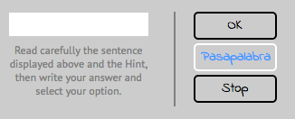

# pasapalabra

This is a customized version of the Pasapalabra game created with HTML, CSS and JavaScript.

---

### How it works:

* Insert a user name to initialize the game, this will be the player id displayed in the game screen.

* Read the sentence in the right side of the screen and don't forget to check the **Hint**.

* Write your answer in the text field and click on the "OK" button.

* If you don't know the answer you can save the question for a second round doing click on the "Pasapalabra" button.

* The left side of the screen will show you the letter to play with and also the result of the previous answers (green or red).

